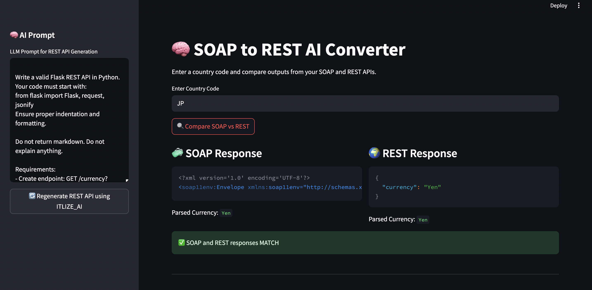

# 🧠 SOAP to REST Converter (AI-powered with Mistral & Ollama)


This project demonstrates how an open-source AI agent (powered by Mistral via Ollama) can intelligently **convert a SOAP API** definition into an equivalent **RESTful Flask API**, and validate functional equivalence between the two.

It includes:
- A mock SOAP API built with `spyne`
- A REST API auto-generated using AI
- A comparison framework to ensure inputs/outputs match
- A visual Streamlit UI to manage everything in one place

---

## 🎯 Purpose

SOAP APIs are often complex and hard to maintain. This demo shows how an agent can help developers **automatically translate** legacy SOAP operations into clean REST APIs — and validate that they behave identically.

---

## 🔧 Tech Stack

- Python 3.10
- Flask (REST API)
- Spyne (SOAP server)
- Ollama + Mistral (AI agent)
- Requests + XML parsing
- Streamlit (interactive UI)
- Shell + CLI-based validation

---

## 📦 Project Structure

```
soap2rest-agent/
├── agents/                     # AI agent code
│   └── soap_to_rest_agent.py
├── rest_output/                # Auto-generated REST API
│   └── generated_rest_api.py
├── test_soap_api.py            # Test SOAP responses
├── compare.py                  # Compare SOAP vs REST
├── mock_soap_server.py         # Local mock SOAP API
├── streamlit_app.py            # Streamlit-based visual UI
├── main.py                     # Orchestrator (AI generation)
├── requirements.txt
└── README.md
```

---

## 🧪 Example: SOAP API vs REST API

### 📦 Original SOAP API (Request)

```xml
POST / HTTP/1.1
Host: 127.0.0.1:8000
Content-Type: text/xml; charset=utf-8

<soapenv:Envelope xmlns:soapenv="http://schemas.xmlsoap.org/soap/envelope/"
                  xmlns:web="http://www.oorsprong.org/websamples.countryinfo">
  <soapenv:Body>
    <web:GetCountryCurrency>
      <web:sCountryISOCode>IN</web:sCountryISOCode>
    </web:GetCountryCurrency>
  </soapenv:Body>
</soapenv:Envelope>
```

### 🔁 SOAP Response

```xml
<GetCountryCurrencyResult>Rupees</GetCountryCurrencyResult>
```

---

### 🚀 AI-Generated REST API (Equivalent)

```http
GET /currency?country_code=IN
```

### ✅ REST Response

```json
{
  "currency": "Rupees"
}
```

---

## 🚀 How to Run

### 1. Start the mock SOAP server:
```bash
python mock_soap_server.py
```

### 2. Generate REST API using AI:
```bash
python main.py
```

### 3. Run the REST API:
```bash
python rest_output/generated_rest_api.py
```

### 4. Launch the Streamlit UI:
```bash
streamlit run streamlit_app.py
```

### 5. (Optional) Compare SOAP vs REST from CLI:
```bash
python compare.py
```

---

## 🔍 Supported Country Codes

- `IN` → Rupees
- `US` → Dollar
- `JP` → Yen

Other codes return `Unknown` or HTTP 400 (invalid).

---

## 📺 Streamlit UI Features

- Input country code and instantly compare SOAP & REST responses
- Live prompt editor to modify LLM input
- Button to regenerate REST API using Mistral
- Code viewer for AI-generated output
- Response diff (match/mismatch validation)

---

## 💡 Future Enhancements

- Code editor to edit & restart REST server live
- History log of comparisons (with match/fail status)
- Batch comparison tool (for multiple inputs)
- REST test code generation (pytest)
- WSDL parser & multi-op support
- Docker-based one-click deployment

---

## 🤝 Credits

- Built by [Anurag Mishra](https://linkedin.com/in/amanuragmishra)
- Powered by [Ollama](https://ollama.com/) + [Mistral](https://mistral.ai)
- Special thanks to `Flask`, `Spyne`, `Streamlit`, and `textwrap` for keeping Python elegant
